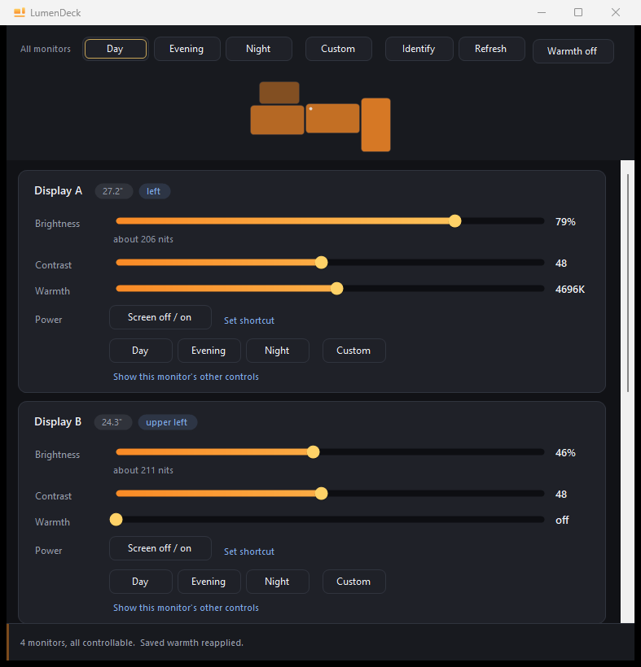

# LumenDeck

**Control the brightness, contrast and colour temperature of every monitor on
Windows — from one window, or one command.**

[](https://github.com/snowyukitty/LumenDeck/actions/workflows/build.yml)
[](LICENSE)
[](#install)
[](#build-from-source)

<br clear="left">

Windows has no brightness control for external monitors. Its slider and the `Fn`
brightness keys drive `WmiMonitorBrightnessMethods`, which exists **only for a
laptop's built-in panel** — plug in a desktop monitor and there is simply no
slider to find. You are meant to reach behind the screen and press buttons.

LumenDeck talks to the monitors directly over **DDC/CI**, the control channel
that rides the video cable and drives the same values as the on-screen menu. A
laptop's internal panel is handled too, over WMI. One app, every screen.

Runs as an ordinary user. No administrator rights, no drivers, no service.

```powershell
lumendeck-cli --list            # every monitor and what it will accept
lumendeck-cli --preset Night    # level the whole desk for the evening
lumendeck-cli -m "left" -b 55 -w 5000
```

<p align="center">
  
</p>

<p align="center"><sub>Three different sliders — 76%, 43%, 56% — and all three read
<b>about 200 nits</b>. That is the whole idea.<br>
Monitor names are anonymised here with <code>LUMENDECK_ANONYMISE=1</code>;
your own screenshots can be too.</sub></p>

---

## What it does

| | |
|---|---|
| **Brightness & contrast** | Per monitor, over DDC/CI (`VCP 0x10` / `0x12`) |
| **Colour temperature** | Per monitor, 3000K–6500K, as a blue light filter |
| **Luminance-matched presets** | Day / Evening / Night — aims every panel at the *same light*, not the same number |
| **Custom** | Your own levels per monitor, remembered as you set them. Every preset is reversible |
| **Everything else your monitor offers** | Input source, picture mode, speaker volume, sharpness, RGB gain, black level, power, factory reset — discovered from each monitor, not assumed |
| **Desk map** | A scale drawing of your actual monitor layout; click a screen to jump to it |
| **Identify** | Puts each monitor's name on its own glass |
| **Laptop panels** | Internal displays via `WmiMonitorBrightnessMethods` |
| **Command line** | Scriptable, with JSON output and meaningful exit codes |
| **Tray app** | Lives in the notification area; optional start-with-Windows |

---

## Three things it does that other brightness tools don't

### 1. Presets match perceived brightness, not slider numbers

An identical DDC value means a different amount of light on different panels. On
a 400-nit monitor and a 250-nit one, **43 and 76 look the same to the eye**.
Setting every screen to "50" is exactly what leaves one glaring next to a
neighbour that looks dead.

LumenDeck models each panel as `nits ≈ floor + (peak − floor) × pct` and solves
for the value that hits the target luminance. On the desk it was built for, four
monitors end up at **76 / 43 / 56 / 50 — and all read ~200 nits.**

Panels it has no profile for get a generic estimate, and the UI *says* it is an
estimate rather than presenting a guess as a measurement. Add your own in
`%APPDATA%\LumenDeck\panels.json`.

A preset moves every screen at once, so there is a **Custom** button beside them
that moves them all back. Your own brightness, contrast and warmth are saved per
monitor the moment you touch a slider — and a preset never overwrites them, so
Day / Evening / Night are somewhere you can return from rather than a one-way
door. Monitors are seeded with whatever they were already set to, so this works
on the very first press, before you have adjusted anything.

### 2. Blue light reduction that works even when the monitor refuses

The obvious way to reduce blue light is the monitor's own RGB gain registers.
**A monitor can advertise those registers and ignore every write to them.** That
was measured here, not assumed: on one of the panels this was built against,
sweeping blue across the full 0–100 range returned an unchanged value thirteen
times in a row while every call reported success. That same panel offers no warm
colour preset at all — only 6500K and *cooler*.

So warmth is applied as a per-display **GPU gamma ramp**, composed on top of
whatever ICC or colorimeter profile is already loaded — and turning it off
restores that profile exactly, instead of flattening your calibration.

Windows Night Light cannot do this: it is one global switch that tints every
attached monitor at once. LumenDeck warms **one screen** and leaves the rest.

The number on the slider is the temperature that reaches the glass, and that is
checked from outside the app rather than asserted. A gamma ramp holds *encoded*
values, so scaling one by `f` scales the emitted light by `f^2.2` — get that
wrong and a screen labelled 4600K delivers nearer 3000K while every value the app
reads back agrees with itself. `test\Test-Gamma.ps1` reads the real ramp off the
GPU and works forward to the light; see [docs/notes.md](docs/notes.md).

### 3. It never asks you to trust a monitor number

`\\.\DISPLAY1`, `2`, `3`… is not a stable identity. The numbering carries gaps
from past hot-plugging, and it need not match the number Windows paints during
*Identify*. Acting on a guessed mapping adjusts the wrong monitor and looks
exactly like success.

LumenDeck labels monitors by **model and physical position**, keys saved settings
on **EDID identity** (falling back to the physical port when two panels are truly
identical), draws your desk to scale, and has its own **Identify**.

---

## Install

Download from **[Releases](../../releases)** — self-contained, nothing to
install alongside it. What changed in each one is in
[CHANGELOG.md](CHANGELOG.md).

Two executables:

| | |
|---|---|
| `LumenDeck.exe` | the window and the tray icon |
| `lumendeck-cli.exe` | the command line |

They are separate binaries on purpose: a GUI-subsystem process cannot stream
stdout back to the shell that launched it, so a single executable pretending to
be both prints nothing when piped.

### Build from source

```powershell
git clone https://github.com/snowyukitty/LumenDeck
cd LumenDeck
dotnet build LumenDeck.slnx -c Release
powershell -File install.ps1        # installs, shortcuts, adds to PATH
```

Needs the [.NET 10 SDK](https://dotnet.microsoft.com/download). `install.ps1
-Uninstall` reverses everything it did.

---

## Command line

```
--list                  Every monitor and its current settings
--json                  Machine-readable output
--features              Extra controls each monitor advertises
--diagnose              Why a monitor does or does not respond

-m, --monitor <text>    Only monitors whose name, position or device matches
-p, --preset <name>     Day | Evening | Night | Custom
-b, --brightness <n>    0-100, or a relative step: +10, -10
-c, --contrast <n>      0-100, or a relative step: +10, -10
-w, --warmth <kelvin>   3000-6500, or "off"
-v, --version           Version
```

Exit codes: `0` done, `1` nothing matched, `2` a monitor refused the change — so
it can be used in a scheduled task or bound to a hotkey by whatever launcher you
already use.

```powershell
# dim everything a notch
lumendeck-cli --brightness -10

# warm only the screen on the left
lumendeck-cli -m left --warmth 4600

# -m narrows what is shown, too
lumendeck-cli --list -m left

# and back to your own levels on every screen
lumendeck-cli --preset Custom

# feed it to something else
lumendeck-cli --list --json | ConvertFrom-Json
```

---

## How it compares

Both alternatives below are good, actively maintained tools. This is about
*what is different*, not what is better.

| | LumenDeck | [Twinkle Tray](https://github.com/xanderfrangos/twinkle-tray) | [Monitorian](https://github.com/emoacht/Monitorian) | Windows Night Light |
|---|---|---|---|---|
| External monitor brightness | ✔ | ✔ | ✔ | ✘ |
| Laptop internal panel | ✔ | ✔ | ✔ | n/a |
| Contrast | ✔ | ✘ | ✔ | ✘ |
| Colour temperature **per monitor** | ✔ | ✘ | ✘ | ✘ (global only) |
| Preserves an existing ICC / calibration | ✔ | n/a | n/a | ✘ |
| Presets matched by **luminance**, not value | ✔ | ✘ | ✘ | ✘ |
| Input source, picture mode, volume, RGB gain… | ✔ | ✘ | ✘ | ✘ |
| Scale drawing of your desk layout | ✔ | ✘ | ✘ | ✘ |
| Command line with JSON | ✔ | ✘ | ✘ | ✘ |
| In the native Windows brightness flyout | ✘ | ✔ | ✘ | n/a |
| Time-of-day automation | ✘ (use the CLI) | ✔ | ✘ | ✔ |

If you want brightness inside the native Windows flyout, Twinkle Tray does that
and LumenDeck does not. If you want a very small brightness-only app, Monitorian
is excellent. LumenDeck is for a **multi-monitor desk where the screens
disagree**.

---

## Troubleshooting

**A monitor is missing, or its sliders are greyed out.**
Run `lumendeck-cli --diagnose`. In order of likelihood:

1. **DDC/CI is switched off in the monitor's own menu.** Several brands ship it
   disabled — look under Settings, OSD, System or Other.
2. **A KVM switch, or some USB-C docks and hubs, do not pass DDC through.**
   Nothing on the PC side can fix that.
3. The panel is a laptop's built-in display — handled, but only where the OEM
   implements the ACPI brightness interface.

**Brightness changes, but nothing else does.** Your monitor advertises the
feature and ignores writes to it. That is common firmware behaviour, not a bug
here; `--features` shows what it actually claims.

**The warmth reverts after a reboot.** A GPU gamma ramp is GPU state, not monitor
state — it is lost on reboot, on a display mode change, on a driver restart, and
when some exclusive-fullscreen games exit. Turn on **Start with Windows** in the
tray menu and LumenDeck reapplies it at login.

**Windows still shows the old icon.** That is the shell icon cache, not the
build.

---

## Configuration

`%APPDATA%\LumenDeck\`

| File | |
|---|---|
| `settings.json` | colour temperature and your Custom levels per monitor, keyed on EDID identity |
| `panels.json` | your own panel luminance profiles; an example is written on first run |
| `gamma-baselines.json` | each display's untouched gamma ramp, so warmth can be undone exactly — see below |
| `error.log` | only if something throws |
| `diag.log` | only when `LUMENDECK_DIAG=1` |

`gamma-baselines.json` is the one file worth understanding. A GPU gamma ramp
outlives the process that set it, so an app that simply reads the ramp at
startup cannot tell your display's own state from the warmth it left there
yesterday — and one that gets this wrong composes warmth onto warmth until
"Warmth off" no longer means anything. LumenDeck stores the untouched ramp plus a
signature of what it last wrote, so it can always recognise its own work and put
your display back. Deleting the file is safe: an ordinary display is recovered
from the shape of its ramp, and a calibrated one is left alone rather than
guessed at.

Set `LUMENDECK_ANONYMISE=1` to replace monitor names with `Display A`, `B`, `C`
in the window, in `--list` and in `--diagnose` — so a screenshot or a pasted
diagnostic can be shared without publishing which monitors you own. It only
changes what is *shown*; the luminance profiles still match on the real name.

---

## Design notes

The interesting problems were not the UI. [docs/notes.md](docs/notes.md) covers
a physical monitor handle that is legitimately `0`, why `SetVCPFeature` returning
success proves nothing, why working set is the wrong instrument for finding a
leak, why colour temperature has to compose rather than overwrite, how a setting
with no way to set it went straight to a stack overflow, and how two version
numbers agreed with each other while both came from the wrong place.

Contributions welcome — see [CONTRIBUTING.md](CONTRIBUTING.md). Luminance
profiles for panels not yet in the table are especially useful.

---

<sub>Keywords: Windows monitor brightness control, external display brightness,
DDC/CI, MCCS, VCP, multi-monitor brightness, per-monitor colour temperature,
blue light filter, night mode, contrast control, monitor input source switching,
KVM, tray app, command line, C#, .NET, WinForms, f.lux alternative, Twinkle Tray
alternative, Monitorian alternative, Windows 10, Windows 11.</sub>

## Licence

MIT. See [LICENSE](LICENSE).
